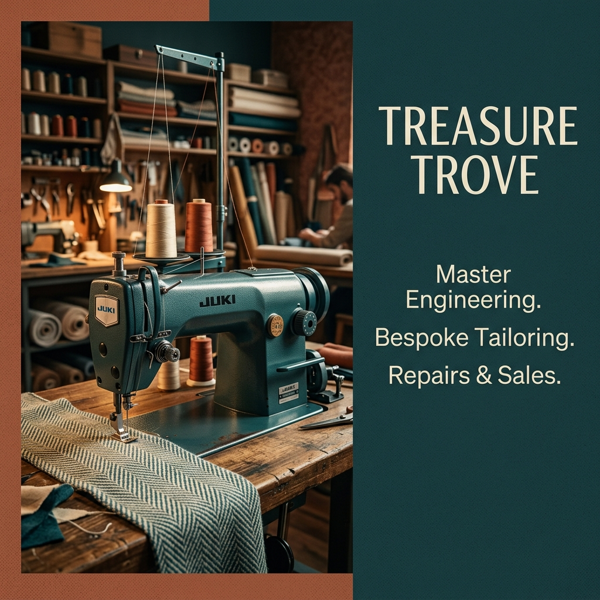

# Treasure Trove | Premium Sewing Machine Engineering

Treasure Trove is a premium digital platform for high-end sewing machine engineering, repairs, and sales. Based in Manchester, the brand bridges the gap between traditional Saville Row-grade tailoring and the modern machinery that powers it.



## 🏛️ The Vision
Treasure Trove is designed to feel like a high-end workshop—rugged yet refined. The interface uses a "Void-Teal-Terracotta" color system to evoke the feeling of historic industrial engineering met with bespoke creative output.

## 🛠️ Technology Stack
- **Framework**: Next.js 14 (App Router)
- **Styling**: Tailwind CSS / Vanilla CSS
- **Animations**: GSAP (GreenSock) for editorial motion and staggered reveals
- **Icons**: Lucide React
- **Type**: Outreach (Display) / Inter (Sans)

## ✨ Core Features
- **Endless Brand Marquee**: A custom, gapless loop of global brand partners (Juki, Brother, Bernina, etc.).
- **Editorial Inventory**: An asymmetric, GSAP-powered gallery of industrial and domestic machines.
- **Dynamic Catalog**: Full technical data and pricing for 15+ industry-standard sewing units.
- **Repair Hub**: A centralized portal for domestic, industrial, and postal repair requests.

## 📁 Directory Structure
- `src/app`: Next.js 14 routes and page layouts.
- `src/components`: Reusable UI components (Marquee, Hero, Modal).
- `src/lib/data.ts`: Centralized brand and product repository.
- `public/`: High-resolution brand assets and original workshop photography.

## 🚀 Getting Started

First, install the dependencies:
```bash
bun install
# or
npm install
```

Run the development server:
```bash
bun dev
# or
npm run dev
```

Open [http://localhost:3000](http://localhost:3000) with your browser to see the result.

## 🎨 Branding
- **Void (#090807)**: The foundation of the site.
- **Teal (#0B3D3D)**: Luxury engineering accent.
- **Terracotta (#CC5434)**: Industrial history accent.
- **Line (#1A1A1A)**: Minimal separation.

---
© 2026 Treasure Trove Sewing Machines. Manchester, UK.
